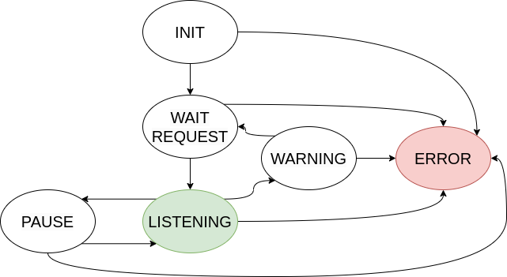

# Microcontroller recruiting task

## Setting up the development environment

- Download STM32 CubeMX from the [official link](https://www.st.com/en/development-tools/stm32cubemx.html) and install it.
- Create a new project selecting the nucleo board you have been assigned.
- Once created the project, go to "Project Manager", fill out the project name, location and select "Makefile" as toolchain. Then click on "GENERATE CODE".

- Open the generated folder in VsCode (you should see something like this).

- Install the STM32 VsCode Extension.

- On the left you should see the extension logo, select it and click on "install build tools", then leave it some time for installation
- After installation you should see on the same place "Build", "Clean build", "Flash", etc...
- Click on build and verify that it builds correctly
- Then connect the nucleo board and verify that it flashes correctly

## The Tools

Aside from the nucleo board, you will be given a Hall Sensor, an easy to use sensor module you can use to sense moving or alternating magnetic fields, typically found in rotating motors, moving magnet, linear magnets, etc. You can build a contactless speed counter or speedometer with this module for measuring the rotation speed of motor by counting the frequency of the motor. You can also use this module to sense a door magnet which is useful if you plan to build projects involves door sensing, window sensing, etc.

> This sensor can works in both analog and digital mode. You can connect the analog output (AO) pin to Arduino to read voltage directly from the A3144 chip, or digital output (DO) to sense the processed output from the module.

Specific Features:
- Comes with A3144 hall-effect sensor chip in front that is sensitive to changing magnetic fields.
- Application such as door sensor, window sensor, contactless tachometer, speedometer, magnetic field sensing, etc.
- Output type : Analog and Digital
- Unipolar hall-effect digital switch

Common Features:
- Logical IC : LM393
- Operating voltage : 5V
- Output current : ?15 mA
- Adjustable sensitivity via potentiometer
- Comes with LED indicators for POWER and OUTPUT
- Fixed bolt holes for easy installation

### Wiring
| Label | Meaning        | Connection                  |
|-------|----------------|-----------------------------|
| VCC   | Power source   | Connect to 5V of system     |
| GND   | Ground         | Connect to GND of system    |
| DO    | Digital Output | Connect to digital IO pin   |
| AO    | Analog Output  | Connect to analog input pin |

## Prerequisites

## The task

The task is composed by the firmware on the nucleo board and the software to plot the data (you can use existing software if you find it).

### Firmware on the nucleo

Your task is to read the hall sensor, both in analog (using the ADC in DMA mode) and digital value (using a GPIO input with interrupt), possibly apply some filters and send the data to serial. Then implement a small CLI with three commands:
- `raw`: remove all filters
- `moving average`: apply a moving average filter with 150 elements
- `random noise`: add artificial random noise <em>ad libitum</em>
You'll also need to read the USER BUTTON and control the USER LED on the nucleo board. The logic should follow this FSM.

- <b>Init</b>. Initialize everything.
- <b>Wait Request</b>. The CLI is on, the led is off, sensor reading is off. If the button is pressed go to the Listening state.
- <b>Listening</b>. The CLI is off and the led is on. Read the sensor, send via serial the data. If the digital value of the hall sensors is high for 5 seconds continuously, then go to the warning state. If the button is pressed, go to the pause state.
- <b>Pause</b>. The CLI is on, the led is blinking with duty cycle 1000 ms, sensor reading is off. If the button is pressed go to the Listening state.
- <b>Warning</b>. The CLI is off, the led is off, sensor reading is off. You must spam in serial "WARNING". If the button is pressed go to the Listening state.
- <b>Error</b>. Any error you encounter will redirect you here. CLI is off, sensor reading is off, the led is blinking with duty cycle 50 ms. You must spam in serial "ERROR" explaining what error occured. The only way to exit this state is to reset the MCU by pressing the USER BUTTON (you must reset the board via software).

If you like, you can use [this library](https://github.com/pbosetti/gv_fsm/) for generating FSM code. Otherwise feel free to implement your own.

### Software on the host PC

On the host PC, plot real time both the analog and digital value from the serial in 2 different plots. You can use anything you want.

#### Bonus Task

From the hall sensors data you receive via serial, modulate the signal <em>ad libitum</em> to play sound. If you use C/C++, [Miniaudio](https://miniaud.io/index.html) is a recommended audio library.

## You can start!

- Create a new GitHub repository and upload the project files via git
- Start working on the task, creating git commits as you make progress
- When it's time to deliver, please send your recruiter a link to your github repository
- Say often "AOOOOOO" to encourage yourself

